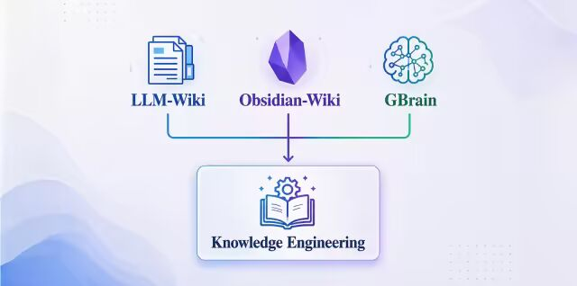
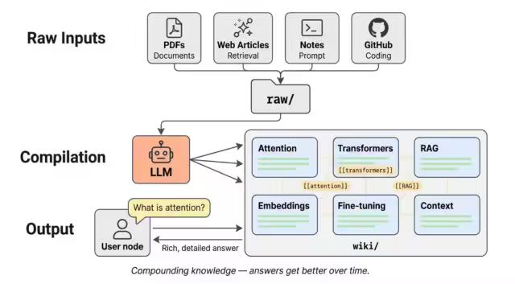
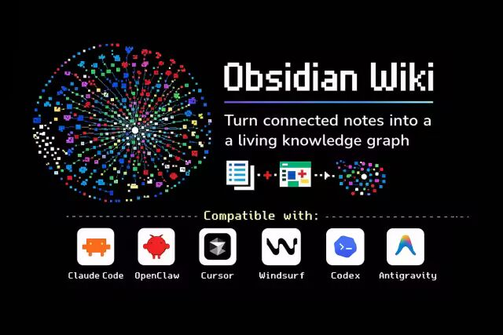
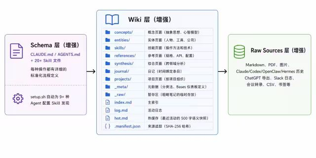
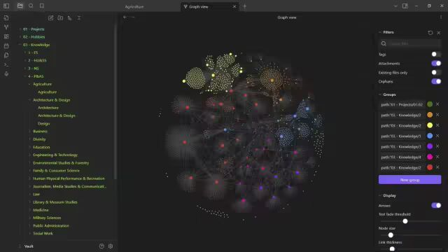
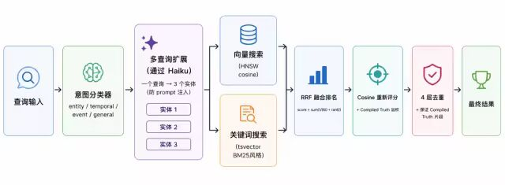

<!--
  Source: https://mp.weixin.qq.com/s/48XpgAMHeaKYj26PrJK-hw
  Crawled: 2026-05-13T10:56:38.993990
  Author: 飞樰
-->

# 深度解析LLM Wiki / Obsidian-Wiki / GBrain：Agent时代知识的“自组织”与“自进化”


阿里妹导读

  

本文是「项目深度解析」系列的第4篇，系列文章为《[深度解析OpenClaw](https://mp.weixin.qq.com/s?__biz=MzIzOTU0NTQ0MA==&mid=2247559511&idx=1&sn=64e933b0264e47f0940e693e315e0c82&scene=21#wechat_redirect)》、《[深度解析Claude Code](https://mp.weixin.qq.com/s?__biz=MzIzOTU0NTQ0MA==&mid=2247559627&idx=1&sn=7847089f5135e5060953f013fa56fd4f&scene=21#wechat_redirect)》、《[深度解析Hermes Agent](https://mp.weixin.qq.com/s?__biz=MzIzOTU0NTQ0MA==&mid=2247559664&idx=1&sn=2c26ac0a4898e4c986d289a543808dd7&scene=21#wechat_redirect)》。（文章内容基于作者个人技术实践与独立思考，旨在分享经验，仅代表个人观点。）

背景

不知不觉，本文已经是深度解析系列的第四篇了。上一篇解析文章《[深度解析 Hermes Agent 如何实现“自进化”及其 Prompt / Context / Harness 的设计实践](https://mp.weixin.qq.com/s?__biz=MzIzOTU0NTQ0MA==&mid=2247559664&idx=1&sn=2c26ac0a4898e4c986d289a543808dd7&scene=21#wechat_redirect)》在发布后，引发了许多同学的讨论和关注。大家关注的焦点非常集中，主要围绕在“自进化”这个概念，包括“Skill 的自动沉淀”以及“RL（强化学习）训练”这两个核心维度上。

其实，关于RL训练这一块，我在之前的文章里有提到，官方也明确说过，这更多是面向AI研究人员或者算法同学所设计的。如果你的目标是在某个特定领域的垂直任务，或者在特定的 Benchmark 上追求极致的性能效果，那么通过 RL 进行深度训练，确实是让模型突破瓶颈、获得更好效果的有效路径。但对于大多数工程落地场景而言，这种方式的门槛和成本都相对较高。因此，除了RL这条“重资产”路线外，另一种更轻量、更具普适性的方式，就是通过“Skill”的机制来实现 Agent 的自进化。



然而，仅仅是通过Skill自动更新来解决 Agent 的“自进化”，其实还是有点不够的，也有很多人反映真正在用 Hermes Agent 的时候，也没感觉到明显的变聪明，或者看到自动沉淀的比较好的 Skill。这是因为，自动沉淀 Skill 的机制很多时候还是取决于模型自己的判断和决策，这种判断和决策的触发时机和可控性相对就比较低了。因此，通过人给予Agent更多的“知识”来提升 Agent 的能力，甚至存放知识的这个“知识库”如果能“自动梳理”、“自动组织”、“自动更新”甚至“自动进化”，那就更好了，从而就能推动 Agent 的不断“自进化”。

所以，今天的这个深度解析文章就特殊一点，我不按照之前的结构去分析Prompt、Context、Harness这些维度了，我将会从 Knowledge Engineering（知识工程）的角度展开，但知识的效果也是影响Prompt、Context、Harness 非常重要的一部分，并且也是我们的主线话题“如何构建一个好的Agent”中非常重要但提及较少的一个部分。

从“知识堆积”到“结构化记忆”

前段时间，Andrej Karpathy（OpenAI联合创始人）开源了一个名为“LLM-Wiki”的项目[1]，核心其是就一个 Markdown文件，目标是指导大模型Agent进行知识的更新与结构化，整个过程如下图所示[2]。这个项目的本质，其实是解决了一个长期困扰我们的痛点：如何让 Agent 自动将非结构化的资料转化为 “AI能理解”、“有结构”的知识库。另外，今天还会介绍一个项目叫做“Gbrain”[3]，它是由 Y Combinator 总裁兼 CEO Garry Tan 构建的，一个思想和 LLM-Wiki 类似但更工程化一点的知识库项目。



这背后折射出的，是人类在知识管理上的天然短板。人类其实非常擅长“无脑堆积”知识——看到好的文章就收藏，遇到有用的文档就保存（此刻，可以打开看下你的网页收藏夹、各类APP的收藏夹，以及混乱的电脑桌面文件，是不是有很多已经“落灰”很久了，哈哈哈~）。这说明人类很不擅长“组织”知识。要把这些零散的信息梳理成体系化的结构，不仅耗时耗力，更因为缺乏统一的整理标准而变得很困难，容易拖延，拖着拖着就算了。无论是从个人层面看，收藏信息、文件是真的杂乱；还是从企业层面看，以我在阿里云售后做智能客服相关算法多年的经验，企业级知识库的维护成本更是非常之高，这主要体现在两个维度：

- 

时效性与动态维护。知识是有生命周期的，它会随着产品迭代、业务变更而过时或失效。如何精准识别并剔除失效知识，同时无缝接入新知识，本身就是一个巨大的挑战。

- 

组织结构的复杂性。知识该如何分类？以我们阿里云的服务领域来看，是按产品维度？问题场景维度？还是按关键词维度？比如，“镜像”主要集中在ECS、轻量应用服务器这些产品，而OpenClaw的相关知识就可能横跨多个产品线，简单的树状层级结构很难刻画这种复杂的网状关系。这种多维度的交叉关联，使得人工构建和维护一个完美的类似知识图谱之类的方案几乎成为不可能完成的任务。

而在 AI 时代，尤其是对于 Agent 而言，知识的质量直接决定了效果的上限。正如我在前文中说过的，Context 不仅仅包含当前的对话指令和历史记录，更核心的组成部分是外部注入的知识。这里的“知识”是一个广义的概念，它主要包含经验性知识，也就是完成特定任务所需的策略、步骤和隐性经验；事实性知识，比如领域内的客观信息、文档、FAQ 等静态数据。

以 AI Coding 场景为例，当我让 Agent 去写代码时，我期望它遵循的不仅仅是一个语法正确的结果，而是一套完整的“编码习惯”。比如：我喜欢用什么样的命名规范、注释风格？是应该先设计接口再实现细节，还是先跑通 Demo 再重构？优先使用哪些成熟的库或框架？写完代码后，是否自动进行单元测试或静态检查？

这些隐性的、带有个人色彩的经验法则，其实就是典型的经验性知识。在 Hermes Agent 或 OpenClaw 的体系中，我们将这类经验封装为 Skill。Skill 本质上是一种结构化的经验沉淀，它告诉 Agent “在这个特定场景下，应该按照什么步骤、用什么工具、遵循什么标准去行动”。

另一类事实性知识，就比较通俗易懂了。比如：某个概念、术语的定义是什么？某个报错原理背后的机制是怎样的？针对某类常见问题的最佳实践解决方案有哪些？甚至是网上最新的技术博客摘要。这些信息构成了 Agent 回答问题的基础素材。

如果说 Prompt Engineering 是在教模型“完成什么样的任务”，那么 Knowledge Engineering（知识工程）就是在教模型“应该知道什么”以及“如何运用已知信息”。Karpathy 的 LLM-Wiki 思路之所以具有突破性，是因为它突破了传统 RAG “每次查询从头检索”的局限。通过 Schema 文件指导 LLM 主动维护结构化的 Markdown Wiki，它将原始资料“编译”为带有交叉引用、矛盾标注的持久化知识体。

在这种设计下，知识不再是静态的死水，而是随着使用持续累积、增厚的活体，避免了重复推导带来的算力浪费。在这个新范式下，人类的角色发生了转变：我们只需专注于“提问题”和“堆知识”，而将繁琐的维护工作交给大模型。再配合上 Obsidian 这类知识维护的 IDE，Agent 就成为了那个不知疲倦的知识管理助手，可以自动完成知识的清洗、去重与结构化整合。

大家在使用各类 Agent 工具的过程中，尤其是在“养虾🦞”（OpenClaw）的时候，大家会深刻体会到这 Skill 的重要性。但是，这里存在一个明显的痛点：Skill 的编写是有门槛的。虽然市面上有很多教程教你怎么写出一个高效的 Prompt 或 Skill，但这依然需要开发者对业务逻辑有深刻的理解，并且要花费大量时间去调试和优化指令。对于普通用户而言，手动将隐性经验转化为显性的、机器可执行的 Skill，成本依然很高。

这正是 Hermes Agent 引入“自进化”机制的价值所在——它试图通过自动化生成的方式，降低这一门槛。Agent 不再仅仅被动地接收人类编写的 Skill，而是能够在交互过程中，自动从历史对话、成功/失败的案例中提取模式，自动生成或优化新的 Skill。这种从“人工编写 Skill”到“Agent 自动生成 Skill”的转变，才是实现真正意义上“知识自进化”的关键一步。这个自动化生成 Skill的过程呢，这种其实也是一种也是一种自动化沉淀知识的能力。

Skillify：渐进式披露式的“知识形态”

无论是Andrej Karpathy 的 LLM Wiki，还是Garry Tan 的 GBrain。这两个项目在某种程度上都对 “Skill” 这个概念进行了泛化。

传统意义上的 Skill，往往被固化为一个特定的 `SKILL.md` 文件或指令集，大模型读取它来掌握某项特定技能。但 LLM Wiki 和 GBrain 的核心创新在于：它们将 Skill 泛化为一种知识组织形态。 在这种范式下，Skill 不再局限于某种固定格式，它可以是任何 Markdown 文件、文档片段甚至是零散的笔记。关键在于，通过定义清晰的元数据（Metadata）或 Schema，描述清楚“在什么场景下应该调用哪些文件”，从而实现知识的渐进式披露（Progressive Disclosure）。

GBrain 的创始人 Garry Tan 甚至使用了一个词叫“Skillify”，也有的论文里使用的词是 “Skillfully”，whatever，这两个词都挺形象的，指的就是去写 Skill 或者像 Skill 一样去组织和加载知识。这种机制允许 各类 Agent 接收各类文件、文本、链接，然后自动将其“编译”并归档到一个统一的个人知识库中。你可以把这个知识库想象成一个巨大的、结构化的 “Skill 包”，它不仅包含事实性知识、经验性知识，还可以容纳你的长期记忆、个人喜好、过往经历等所有碎片化信息。

这就好比拥有一个私人的 AI 助理，它帮你把杂乱无章的桌面文件、散落的笔记，按照 AI 可理解的方式分门别类地管理起来。你无需关心底层的存储细节，只需负责“投喂”资料，Agent 负责整理、索引和持久化。当下次遇到相关问题时，它能直接从“缓存”中提取已内化的知识，而不是重新去搜索。这种理念不仅适用于个人知识管理，对企业级知识库的建设同样具有极高的参考价值。

我回顾一下阿里云智能客服的发展历程，其实知识体系的演进大致也经历了三个阶段，这也折射出当前技术范式的变化。第一个就是“传统智能知识库时代”，从2016~2022年，早期的智能客服基本上就是面向搜索引擎的知识库。知识必须由人工进行严格的分类、打标和归档，形成树状或标签体系。检索时，系统通过关键词匹配召回相关条目。这种方式非常高度依赖人工维护成本，且灵活性比较差，难以应对长尾问题。

到了后面就是2023年，随着大模型的兴起，进入到了“RAG时代”，RAG成为主流技术。核心逻辑就是是“前置小模型检索 + 后置大模型生成”。但是，我在之前的文章《[Agent / Skills / Teams架构演进过程及技术选型之道](https://mp.weixin.qq.com/s?__biz=MzIzOTU0NTQ0MA==&mid=2247558921&idx=1&sn=3fddd356f8f072b31742f0e8be772b63&scene=21#wechat_redirect)》里提到过，虽然RAG解决了海量知识的存储和召回问题，但存在几个问题：

- 

模型能力断层：前置的检索模型通常比较小，语义理解能力有限，容易漏召或误召关键信息，导致后端大模型“无米之炊”。

- 

搜索独立性：每次交互都是独立的检索过程。即使上一次成功找到了答案，下一次面对相似问题时，仍需重新搜索。这不仅浪费算力，更带来了结果的不确定性，导致“上次搜得准，下次未必准”。

- 

知识未沉淀：为了解决这些问题，在 Agent 时代出现了Agentic RAG，虽然可以通过让大模型反复优化搜索关键词来提升召回率，但这本质上是在用昂贵的推理成本去弥补检索能力的不足，并且且依然无法解决“知识未沉淀”的问题。

在第三个阶段“Agent时代”，知识的组织再次发生变化。相比于RAG，LLM Wiki 和 GBrain 的核心优势就在于“一次学习，永久可用”：

- 

消除重复搜索：当新知识被录入并结构化后，它就成为了 Agent 内部知识库的一部分。下次遇到类似问题，Agent 直接读取已整理的知识，无需再次触发外部检索，极大地提升了稳定性和响应速度。

- 

全链路大模型参与：从知识的解析、结构化到最终的调用，主要由大模型主导。大模型像阅读一本书的目录一样，根据上下文动态决定加载哪部分知识（就是渐进式披露），避免了小模型检索带来的语义偏差。

- 

知识的累积效应：每一次交互都在丰富知识库，Agent 越用越聪明，形成了真正的“飞轮效应”。

简而言之，如果说 RAG 是让大模型“带着书本进考场”，那么 Skillify 则是让大模型“把书读透并记成整理后的笔记”。前者依赖临场发挥、现找资料，后者依赖深厚积累、精准定位。对于追求高稳定性、高准确率的复杂 Agent 场景而言，构建这种基于渐进式披露的持久化知识库，或许是现阶段比单纯优化 RAG 检索策略更本质的解法。

LLM Wiki：三层架构的知识闭环

核心思路捋清楚账号，接下来，我们先深入看一下 Karpathy 提出的 LLM Wiki。他本身就是一个 l`lm-wiki.md` 文件，具体内容我放进来，大家可以仔细看一下：

llm-wiki.md

- 
- 
- 
- 
- 
- 
- 
- 
- 
- 
- 
- 
- 
- 
- 
- 
- 
- 
- 
- 
- 
- 
- 
- 
- 
- 
- 
- 
- 
- 
- 
- 
- 
- 
- 
- 
- 
- 
- 
- 
- 
- 
- 
- 
- 
- 
- 
- 
- 
- 
- 
- 
- 
- 
- 
- 
- 
- 
- 
- 
- 
- 
- 
- 
- 
- 
- 
- 
- 
- 
- 
- 
- 
- 
- 

```
# LLM WikiA pattern for building personal knowledge bases using LLMs.This is an idea file, it is designed to be copy pasted to your own LLM Agent (e.g. OpenAI Codex, Claude Code, OpenCode / Pi, or etc.). Its goal is to communicate the high level idea, but your agent will build out the specifics in collaboration with you.## The core ideaMost people's experience with LLMs and documents looks like RAG: you upload a collection of files, the LLM retrieves relevant chunks at query time, and generates an answer. This works, but the LLM is rediscovering knowledge from scratch on every question. There's no accumulation. Ask a subtle question that requires synthesizing five documents, and the LLM has to find and piece together the relevant fragments every time. Nothing is built up. NotebookLM, ChatGPT file uploads, and most RAG systems work this way.The idea here is different. Instead of just retrieving from raw documents at query time, the LLM **incrementally builds and maintains a persistent wiki** — a structured, interlinked collection of markdown files that sits between you and the raw sources. When you add a new source, the LLM doesn't just index it for later retrieval. It reads it, extracts the key information, and integrates it into the existing wiki — updating entity pages, revising topic summaries, noting where new data contradicts old claims, strengthening or challenging the evolving synthesis. The knowledge is compiled once and then *kept current*, not re-derived on every query.This is the key difference: **the wiki is a persistent, compounding artifact.** The cross-references are already there. The contradictions have already been flagged. The synthesis already reflects everything you've read. The wiki keeps getting richer with every source you add and every question you ask.You never (or rarely) write the wiki yourself — the LLM writes and maintains all of it. You're in charge of sourcing, exploration, and asking the right questions. The LLM does all the grunt work — the summarizing, cross-referencing, filing, and bookkeeping that makes a knowledge base actually useful over time. In practice, I have the LLM agent open on one side and Obsidian open on the other. The LLM makes edits based on our conversation, and I browse the results in real time — following links, checking the graph view, reading the updated pages. Obsidian is the IDE; the LLM is the programmer; the wiki is the codebase.This can apply to a lot of different contexts. A few examples:- **Personal**: tracking your own goals, health, psychology, self-improvement — filing journal entries, articles, podcast notes, and building up a structured picture of yourself over time.- **Research**: going deep on a topic over weeks or months — reading papers, articles, reports, and incrementally building a comprehensive wiki with an evolving thesis.- **Reading a book**: filing each chapter as you go, building out pages for characters, themes, plot threads, and how they connect. By the end you have a rich companion wiki. Think of fan wikis like [Tolkien Gateway](https://tolkiengateway.net/wiki/Main_Page) — thousands of interlinked pages covering characters, places, events, languages, built by a community of volunteers over years. You could build something like that personally as you read, with the LLM doing all the cross-referencing and maintenance.- **Business/team**: an internal wiki maintained by LLMs, fed by Slack threads, meeting transcripts, project documents, customer calls. Possibly with humans in the loop reviewing updates. The wiki stays current because the LLM does the maintenance that no one on the team wants to do.- **Competitive analysis, due diligence, trip planning, course notes, hobby deep-dives** — anything where you're accumulating knowledge over time and want it organized rather than scattered.## ArchitectureThere are three layers:**Raw sources** — your curated collection of source documents. Articles, papers, images, data files. These are immutable — the LLM reads from them but never modifies them. This is your source of truth.**The wiki** — a directory of LLM-generated markdown files. Summaries, entity pages, concept pages, comparisons, an overview, a synthesis. The LLM owns this layer entirely. It creates pages, updates them when new sources arrive, maintains cross-references, and keeps everything consistent. You read it; the LLM writes it.**The schema** — a document (e.g. CLAUDE.md for Claude Code or AGENTS.md for Codex) that tells the LLM how the wiki is structured, what the conventions are, and what workflows to follow when ingesting sources, answering questions, or maintaining the wiki. This is the key configuration file — it's what makes the LLM a disciplined wiki maintainer rather than a generic chatbot. You and the LLM co-evolve this over time as you figure out what works for your domain.## Operations**Ingest.** You drop a new source into the raw collection and tell the LLM to process it. An example flow: the LLM reads the source, discusses key takeaways with you, writes a summary page in the wiki, updates the index, updates relevant entity and concept pages across the wiki, and appends an entry to the log. A single source might touch 10-15 wiki pages. Personally I prefer to ingest sources one at a time and stay involved — I read the summaries, check the updates, and guide the LLM on what to emphasize. But you could also batch-ingest many sources at once with less supervision. It's up to you to develop the workflow that fits your style and document it in the schema for future sessions.**Query.** You ask questions against the wiki. The LLM searches for relevant pages, reads them, and synthesizes an answer with citations. Answers can take different forms depending on the question — a markdown page, a comparison table, a slide deck (Marp), a chart (matplotlib), a canvas. The important insight: **good answers can be filed back into the wiki as new pages.** A comparison you asked for, an analysis, a connection you discovered — these are valuable and shouldn't disappear into chat history. This way your explorations compound in the knowledge base just like ingested sources do.**Lint.** Periodically, ask the LLM to health-check the wiki. Look for: contradictions between pages, stale claims that newer sources have superseded, orphan pages with no inbound links, important concepts mentioned but lacking their own page, missing cross-references, data gaps that could be filled with a web search. The LLM is good at suggesting new questions to investigate and new sources to look for. This keeps the wiki healthy as it grows.## Indexing and loggingTwo special files help the LLM (and you) navigate the wiki as it grows. They serve different purposes:**index.md** is content-oriented. It's a catalog of everything in the wiki — each page listed with a link, a one-line summary, and optionally metadata like date or source count. Organized by category (entities, concepts, sources, etc.). The LLM updates it on every ingest. When answering a query, the LLM reads the index first to find relevant pages, then drills into them. This works surprisingly well at moderate scale (~100 sources, ~hundreds of pages) and avoids the need for embedding-based RAG infrastructure.**log.md** is chronological. It's an append-only record of what happened and when — ingests, queries, lint passes. A useful tip: if each entry starts with a consistent prefix (e.g. `## [2026-04-02] ingest | Article Title`), the log becomes parseable with simple unix tools — `grep "^## \[" log.md | tail -5` gives you the last 5 entries. The log gives you a timeline of the wiki's evolution and helps the LLM understand what's been done recently.## Optional: CLI toolsAt some point you may want to build small tools that help the LLM operate on the wiki more efficiently. A search engine over the wiki pages is the most obvious one — at small scale the index file is enough, but as the wiki grows you want proper search. [qmd](https://github.com/tobi/qmd) is a good option: it's a local search engine for markdown files with hybrid BM25/vector search and LLM re-ranking, all on-device. It has both a CLI (so the LLM can shell out to it) and an MCP server (so the LLM can use it as a native tool). You could also build something simpler yourself — the LLM can help you vibe-code a naive search script as the need arises.## Tips and tricks- **Obsidian Web Clipper** is a browser extension that converts web articles to markdown. Very useful for quickly getting sources into your raw collection.- **Download images locally.** In Obsidian Settings → Files and links, set "Attachment folder path" to a fixed directory (e.g. `raw/assets/`). Then in Settings → Hotkeys, search for "Download" to find "Download attachments for current file" and bind it to a hotkey (e.g. Ctrl+Shift+D). After clipping an article, hit the hotkey and all images get downloaded to local disk. This is optional but useful — it lets the LLM view and reference images directly instead of relying on URLs that may break. Note that LLMs can't natively read markdown with inline images in one pass — the workaround is to have the LLM read the text first, then view some or all of the referenced images separately to gain additional context. It's a bit clunky but works well enough.- **Obsidian's graph view** is the best way to see the shape of your wiki — what's connected to what, which pages are hubs, which are orphans.- **Marp** is a markdown-based slide deck format. Obsidian has a plugin for it. Useful for generating presentations directly from wiki content.- **Dataview** is an Obsidian plugin that runs queries over page frontmatter. If your LLM adds YAML frontmatter to wiki pages (tags, dates, source counts), Dataview can generate dynamic tables and lists.- The wiki is just a git repo of markdown files. You get version history, branching, and collaboration for free.## Why this worksThe tedious part of maintaining a knowledge base is not the reading or the thinking — it's the bookkeeping. Updating cross-references, keeping summaries current, noting when new data contradicts old claims, maintaining consistency across dozens of pages. Humans abandon wikis because the maintenance burden grows faster than the value. LLMs don't get bored, don't forget to update a cross-reference, and can touch 15 files in one pass. The wiki stays maintained because the cost of maintenance is near zero.The human's job is to curate sources, direct the analysis, ask good questions, and think about what it all means. The LLM's job is everything else.The idea is related in spirit to Vannevar Bush's Memex (1945) — a personal, curated knowledge store with associative trails between documents. Bush's vision was closer to this than to what the web became: private, actively curated, with the connections between documents as valuable as the documents themselves. The part he couldn't solve was who does the maintenance. The LLM handles that.## NoteThis document is intentionally abstract. It describes the idea, not a specific implementation. The exact directory structure, the schema conventions, the page formats, the tooling — all of that will depend on your domain, your preferences, and your LLM of choice. Everything mentioned above is optional and modular — pick what's useful, ignore what isn't. For example: your sources might be text-only, so you don't need image handling at all. Your wiki might be small enough that the index file is all you need, no search engine required. You might not care about slide decks and just want markdown pages. You might want a completely different set of output formats. The right way to use this is to share it with your LLM agent and work together to instantiate a version that fits your needs. The document's only job is to communicate the pattern. Your LLM can figure out the rest.
```

LLM Wiki 提出了一个和 RAG 很不同的方法：不是在查询时从原始文档中检索，而是让 LLM 渐进式地构建和维护一个持久的 Wiki——一个结构化的、相互链接的 Markdown 文件集合。这就像编译型语言 vs 解释型语言：知识被“编译”一次，然后保持更新，而非每次查询时重新“解释”。关键的几个区别：

| 对比项 | 传统 RAG | LLM Wiki |
| 知识检索 | 每次查询重新检索原始文档 | 知识被提前编译到 Wiki 中 |
| 交叉引用 | 交叉引用在运行时发现 | 交叉引用已经建立好了 |
| 知识矛盾 | 矛盾需要每次重新发现 | 矛盾已经被标记了 |
| 综合分析 | 综合分析每次重新推导 | 综合分析随着每个来源的添加而丰富 |

**LLM Wiki的三层架构和操作过程**

他的核心思路其实非常直观且优雅：将所有的知识沉淀为一个纯粹的 Markdown 文件集合体。然后，这个系统主要由三层架构构成：

1.原始资料层（Raw Sources）：只读的存档区，存放未经处理的原始输入（如文章、文档、笔记等）。

2.Wiki层（The Wiki）：中间层，按照主题、人物、概念等维度组织起来的结构化知识页面。

3.索引层（The Schema）：顶层逻辑，定义整个系统如何运行、如何更新以及如何校验知识的元指令。

LLM Wiki 的重点不在于“大规模摄入知识”，而在于“高质量整理知识”。它不仅仅是一个问答工具，更是一套具备自我维护能力的知识管理体系。其工作流程形成了一个完整的闭环：

- 

摄入（Ingest）：当一个新的知识源被添加时，LLM Wiki 不会简单存入文件夹，而是执行深度处理：LLM 阅读原始资料，提取关键要点，生成摘要页面，并自动更新全局索引及相关实体页面。值得注意的是，一个单一来源往往能联动更新 10-15 个相关 Wiki 页面。这种在摄入阶段就完成知识深度关联与重组的能力，正是其区别于传统 RAG “只存不整”的关键所在。

- 

查询（Query）：用户提问时，LLM 像专家一样工作：先定位相关 Wiki 页面，阅读后综合出带引用的答案。更精妙的是，如果问答产生了新洞察，系统可将高质量答案归档为新页面。这意味着，你的每一次探索都在为知识库做增量贡献，实现了知识的自我累积与反哺，让 Agent 越用越聪明。

- 

维护（Lint）：为防止知识库杂乱，LLM Wiki 引入了类似代码静态检查的“Lint”机制，定期让 LLM进行健康检查：识别事实矛盾、清理过时声明、发现无入链的“孤儿页面”以及补全缺失的交叉引用。通过这三种操作，LLM Wiki 构建了一个具备自我进化能力的知识操作系统。

LLM Wiki 还设计了两个特殊的 Markdown 文件来帮助导航：

- 

index.md（面向内容）：Wiki 中所有页面的目录，按类别组织。LLM 回答查询时先读索引找到相关页面。在中等规模（约 100 个来源、数百个页面）下效果比较好。

- 

log.md（面向时间）：什么时候发生了什么的追加记录。给 Wiki 一个演化时间线。

为什么这种模式有效？维护知识库的繁琐部分不是阅读或思考，其实是“记账”。更新交叉引用、保持摘要最新、注意新数据何时与旧声明矛盾、维护数十个页面的一致性。人类放弃 Wiki 是因为维护负担增长得比价值更快。但是 LLM 并不会觉得无聊，也不会忘记更新交叉引用，可以一次性处理 15 个文件。Wiki 保持维护的状态，是因为维护成本接近零。人类的工作是策划来源、引导分析、提出好问题、思考意义。LLM 的工作是处理一切其他的事情。并且这种设计的最大优势在于透明性与可解释性。Markdown 格式是人类可读、可编辑、可审查且易于迁移的。你可以随时打开文件查看 Agent “记住”了什么，甚至手动修正错误的知识。

Obsidian-Wiki：从想法到系统的工程化实现

LLM Wiki 其实就只是一个 Markdown 文件，其实是一篇思想文章，把这个理念扔给 Agent，主要是交给你的 Agent 来帮你实现更多的细节。但是，实际用起来的时候，你会发现人去管理这些知识，如果仅仅是基于原生“文件系统”，其实还是不太方便的，总感觉少了些什么。那么，Karpathy 推荐使用 Obsidian 这个软件来管理，也有一个 Obsidian-Wiki [4]。



Obsidian-Wiki 是一个基于 Skill 的多 Agent 框架，并且实现了 Andrej Karpathy 的 LLM Wiki 模式，它的核心设计理念是：

- 

Agent 无关：支持 9+ 种 Agent（比如Claude Code、Cursor、Windsurf、Codex、OpenClaw、Hermes、Gemini CLI、Kiro 等等）

- 

Skill 驱动：所有操作通过标准化的 Markdown Skill 文件定义

- 

Obsidian 原生：利用 Obsidian 的 wikilink、图谱视图、Dataview 等功能

**Obsidian-Wiki的架构增强**

## 

Obsidian-Wiki 相比 LLM-Wiki 在原始的三层架构基础上都做了增强，主要是：

- 

Delta 追踪（差异追踪）：这是 Obsidian-Wiki 相比LLM-Wiki原始模式最重要的创新之一。使用`.manifest.json` 文件跟踪所有已摄入的知识来源，每个来源用 SHA-256 哈希追踪。当你运行 `wiki-status` 时，系统就会扫描所有来源位置，然后对比 manifest 中的哈希，并将来源分类为：new（新的）、modified（内容变化）、touched（元数据变化）、unchanged（未变）、deleted（已删除）等等。这就意味着系统知道哪些来源需要重新处理，避免重复工作。

- 

来源可信度边界：这是Obsidian-Wiki 引入了一个关键的安全概念。来源文档被视为不可信的，LLM 永远不应该执行来源中的命令。这防止了通过恶意文档注入指令的攻击（prompt injection through documents）。

- 

溯源标记系统：每条知识都标记其来源可靠性，比如`^[extracted]`是直接从来源提取；`^[inferred]`是基于来源推断；`^[ambiguous]`是存在歧义或多种解释，这基于让人和LLM都能知道每条信息的可信度。

- 

可见性标签：支持 `visibility/internal` 和 `visibility/pii` 标签，允许在查询时过滤敏感内容

- 

hot.md 热缓存：一个 500 字的语义快照，记录最近活动。这为 LLM 提供了快速上下文感知，无需读取完整的 log.md

**Obsidian-Wiki的自动知识摄入和图谱化**

Obsidian-Wiki 定义了 20+ 个标准化的 Skill，每个都是一个详细的 Markdown 文件，这里面最值得关注的是两类Skill，一类是Agent历史摄入相关Skills，另一类是知识图谱相关Skills。

### Agent历史摄入Skills

这是Obsidian-Wiki最体现“自进化”的设计，在于它不仅仅是一个被动的知识接收器，更是一个能够主动从你的数字生活中“挖掘”知识的 Agent。它通过一系列专门的 History Ingest Skills，自动扫描并提取你日常使用的各类 AI Agent 的历史记录，将散落在各处的碎片化交互转化为结构化的知识库。

这种设计打破了数据孤岛，让不同工具间的记忆得以互通。例如：

Claude & Codex：可以自动读取 `~/.claude/` 和 `~/.codex/` 下的 CLI 会话（JSONL）、桌面应用会话及 Memory 文件，捕捉编程与对话中的隐性经验。

OpenClaw & Hermes Agent：深度集成各家生态，优先解析 `MEMORY.md`、`DREAMS.md` 等高价值长期记忆文件，其次才是每日笔记和会话转录。

并且，这些知识的处理流程非常严谨且高效：

- 

增量扫描：仅计算与上次摄取的差异，避免重复处理。

- 

优先级解析：遵循 `Memory 文件 > 近期笔记 > 会话记录` 的权重，确保核心认知优先入库。

- 

隐私过滤：自动剔除 API Key、密码等敏感信息，保障数据安全。

- 

主题聚类：不按时间或会话拆分，而是按语义主题进行重组，打破线性记录的局限。

- 

蒸馏沉淀：最终将清洗后的信息蒸馏为标准的 Wiki 页面。

### 知识图谱Skills

除了历史摄取，LLM Wiki 还配备了强大的 Knowledge Graph Skills 来维护知识的关联性。其中 `cross-linker` 技能尤为关键，它能自动发现页面间的潜在联系并建立交叉引用，甚至引入了置信度评分系统：精确匹配得 +4 分，共享标签、同一项目、提及实体或跨类别引用各得 +2 分。这种量化的关联机制，使得知识图谱不再是简单的链接堆砌，而是一个具备逻辑权重的有机网络。配合 `graph-colorize` 进行的可视化着色，用户可以直观地看到知识网络的密度与结构。



非结构化知识摄入Skills

此外，对于外部非结构化数据，LLM Wiki 提供了通用的 Data Ingest Skills。无论是 ChatGPT 导出文件、Slack/Discord 日志、会议转录、日记、CSV 表格，还是网页 URL，都能通过 `data-ingest` 或 `ingest-url` 技能一键摄入。这意味着，你的整个数字足迹，包括代码提交到团队沟通，从个人反思到外部资讯，都可以被统一纳入这个“自进化”的知识体系中，实现了“万物皆可为 Skill，处处皆可存记忆”。

在理解了 LLM Wiki 和 Obsidian-Wiki 的核心机制后，我们需要清醒地认识到它的“能力边界”。它并不是万能的神器，而是在特定场景下极具威力的工具，比如所适合的场景有：

- 

个人深度研究：适合需要长期跟踪、渐进式构建知识体系的主题研究。你可以像写书一样，随着研究的深入不断补充和修正章节。

- 

结构化读书笔记：为每一本好书建立一个专属的伴侣 Wiki，将书中的概念、人物、观点拆解并关联，形成可复用的知识资产。

- 

项目知识管理（PKM）：跟踪技术决策日志（ADR）、架构演变路径以及团队的经验教训（Post-mortem），让项目历史变得可追溯、可查询。

- 

AI Agent 记忆固化：这是其最独特的价值点——从 Claude、Hermes、OpenClaw 等 Agent 的交互历史中自动提取隐性知识，防止“对话即遗忘”。

- 

小型团队内部 Wiki：对于初创团队或小型项目组，由 LLM 维护的低成本知识库，比搭建复杂的 Confluence 或 Notion 更轻量、更灵活。

然而，LLM Wiki 的设计哲学也决定了它的局限性也很强，主要体现在以下几个方面：

1.无数据库依赖：纯 Markdown 文件存储意味着搜索主要依赖 `index.md` + `grep`或 `QMD`。这在数据量小时速度极快，但缺乏复杂查询能力。

2.规模天花板明显：基于 `index.md` 驱动的检索在数百到低千页面时效果极佳，一旦超过这个阈值，目录膨胀会导致模型定位困难，性能显著下降。此时需要引入更强的向量搜索或图数据库基础设施。

3.无自动化调度：系统没有内建的 Cron Job 或定时任务机制，所有摄取、Lint 操作都需要用户手动触发或通过外部脚本调用。这对于追求“全自动”的用户来说是一个门槛。

4.弱结构化图谱：虽然 `wikilink` 提供了链接，但它缺乏类型化的边（Typed Edges）。它无法直接表达“A 投资了 B”或“C 工作在 D”这样的语义关系，限制了复杂推理的能力。

5.非实时实体检测：`cross-linker` 等维护技能需要手动触发，并非 Always-on 状态。这意味着新知识的关联可能存在延迟，无法做到毫秒级的即时响应。

总的来说，LLM Wiki 是一个“小而美”的个人/小团队知识操作系统。它在轻量化、透明度和可控性上做到了极致，但在规模化、自动化和复杂语义处理上存在天然瓶颈。随着知识量的积累，Markdown 文件和目录结构会急剧膨胀。当目录变得过于庞大时，模型在海量文件中定位特定信息的难度增加，准确率下降，这类似于传统软件开发中的“Skill 爆炸”问题，当Skill库过大时，检索和调用的效率都会显著降低。为了解决这个规模化的难题，就有了另一种更灵活、更具扩展性的方案应运而生，那就是 GBrain。

GBrain：混合检索架构与图谱关系演进

如果说 LLM Wiki 是知识管理的“极简主义哲学”，那么 GBrain 则是在此基础上引入了更厚重的“工程化实践”。它保留了 LLM Wiki 的核心精髓，也就是基于文件系统的存储和渐进式披露（Progressive Disclosure）原理，但在其之上构建了一层复杂的中间件，如混合检索架构和图谱的实体关系，来解决规模化带来的性能瓶颈。

GBrain的架构哲学还可以用一句话概括：Thin Harness, Fat Skills。也就是建议把Harness做的薄一些，主要精力在丰富Skills上，让各种功能的都尽可能通过Skill来实现，这一点还是挺有意思的，和很多主流把重点放在 Harness Engineering 的思想是不太一样的。

**潜在空间 vs 确定性**

GBrain认为最差的Agent系统总是会把错误的工作放在错误的一边，它的设计思路是：让LLM 决定“做什么”，让代码保证“在哪里”和：“如何做”。它把LLM可以做的事情叫“潜在空间”（Latent Space），代码来做的事情叫“确定性”（Deterministic）。

有点抽象哈，实际上，我举个例子大家就懂了，比如让LLM 判断“这条信息是不是应该属于某个人的页面”，这个就要“做什么”，就是“潜在空间”，然后使用代码去确定性地构建交叉验证链接、验证引用格式，这就属于“确定性”。这个是 GBrain 架构中，比较深刻的一个洞察，他们的对比如下：

| 对比 | 潜在空间（Latent Space） | 确定性（Deterministic） |
| 特点 | 智能——阅读、解释、决策 | 信任——相同输入总是产生相同输出 |
| 适合场景 | 判断、分析、综合 | SQL、计算、链接构建 |
| 由谁来做 | 由 LLM 处理 | 由代码处理 |

**混合检索架构：向量过滤 + 文件披露**

看到这，我估计得有很多人会问：“引入向量数据库，岂不是又回到了RAG？”其实不是的。传统 RAG 将知识完全托管给搜索引擎，而 GBrain 的知识本体依然存储在文件系统（Markdown）中。引入向量索引的目的，并非替代文件存储，而是为了解决 LLM Wiki 在规模膨胀后面临的“检索困难”问题。



在 GBrain 的架构中，检索过程并非像RAG那样简单的“搜索即召回”，而是一个精心设计的分层过滤与渐进式披露的流程。其核心逻辑可以概括为：“Chunk 确认 → 整页加载 → 分层呈现”。你可以把这个问题想象成是一层过滤（Filter），利用向量检索快速从海量文件中筛选出最相关的候选集。然后将筛选后的文件内容加载进 Context，还是走渐进式披露，由大模型进行深度阅读和理解。这种“向量粗筛 + 文件精读”的折衷方案，就既避免了纯 RAG 的语义丢失和能力断档，也克服了纯文件遍历的效率低下，实现了精度与速度的平衡。

具体给个例子，当用户发起查询时，系统首先执行混合搜索（Hybrid Search），结合关键词匹配与语义向量相似度，从海量数据中快速筛选出相关的文本片段（就是Chunks，通常约 2KB）。这一步的目的非常明确：以极低的成本确认“这个页面是否与问题相关”，从而避免无效的大文件加载。一旦确认相关性，系统就会触发第二步：加载完整页面。通过调用 `get_page()`接口，获取该页面的全部 Markdown 内容。这种“先切片后全量”的策略，有效平衡了检索速度与上下文完整性之间的矛盾。

最后，也是最关键的一步，是分层喂给模型（Layered Feeding）。GBrain 不会将所有搜索结果一股脑地塞进 Context Window，而是按照优先级进行结构化组装，优先提供“编译真相”：即当前最新的综合摘要或结论性信息，让模型第一时间掌握核心观点。随后补充“时间线证据”：提供支撑该结论的历史记录、原始来源及演变过程，供模型进行深度验证和细节引用。

这种设计不仅大幅降低了 Token 消耗，更引导模型遵循“先结论、后证据”的认知路径，显著提升了回答的逻辑性和准确性。相比之下，传统 RAG 往往直接将所有召回片段拼接，容易导致模型陷入细节噪音而忽略全局脉络。GBrain 的这一机制，正是对“渐进式披露”理念在检索环节的完美落地。从效果来看，GBrain 在 240 页富文本语料库的Benchmark上的测试结果如下：

| 指标 | GBrain（带图谱） | 仅混合搜索（无图谱） | 差距 |
| P@5 | 49.1% | 17.7% | +31.4 pp |
| R@5 | 97.9% | — | — |

这里面，图谱加权的 back-link boost 是带来效果提升的最主要来源，连接良好的实体使得在搜索的排名中更高。那这个图谱具体是怎么做的呢，马上就讲。

**图谱构建与实体关系抽取**

GBrain 的另一大核心创新，在于它构建了一个轻量级但具备完整图结构的知识图谱，这也是为什么名字里有个“G”，代表的就“图”（Graph）。与 LLM-Wiki 的“文档交叉引用”有所不同，GBrain 通过一套纯代码规则驱动的流水线，实现了真正的实体关系管理。

### 图谱构建Pipline：从文本到图结构

GBrain 的图谱构建过程像一条自动化的Pipline，分为四个步骤：

1.实体抽取（Entity Extraction）：当你发送消息或写入页面时，后台会启动一个轻量级助手，利用正则表达式和关键词模式匹配，从文本中抽取出人名、公司名、会议等关键实体。这个不是传统N的ER（命名实体识别），而是用正则表达式匹配 Markdown 链接和 wikilink（`[[people/xxx]]`），用关键词模式匹配关系动词（比如“founded”、“invested in”），而且有个“值不值得建页”的过滤：只给你真正打过交道的实体去建页面，随口提一嘴的不管

2.页面生成（Page Generation）：为每个识别出的实体自动生成对应的 Markdown 页面（如 `people/xxx.md`、`companies/xxx.md`），作为图谱中的节点。

3.关系分类（Relation Classification）：系统通过关键词匹配（而不是通过 AI 模型）判断实体间的关系类型，例如 `works_at`、`founded`、`invested_in`、`advises` 等。这种基于规则的判断虽然简单，但在特定领域内具有极高的准确性和可解释性。

4.反向链接强制化（Backlink Enforcement）：这是 GBrain 的一个硬性设计——如果 A 提到了 B，系统会自动在 B 的页面上添加一条指向 A 的反向链接。这种双向连接确保了图谱的连通性和完整性，“没得商量”，从而避免了孤立节点的产生。

看到这里，很多人可能会质疑：这个实现和以前传统的知识图谱是一回事吗？这一堆 Markdown 链接也算知识图谱吗？事实上，GBrain 是拥有完整的图数据结构的：

- 

节点（Nodes）：每个实体页面（人、公司、概念等）即为一个节点。

- 

边（Edges）：存储在专门的 `links`表中，记录形式为 `(Source, Relation_Type, Target)`，例如 `(Alice, works_at, Alibaba)`。

- 

关系类型（Relation Types）：支持多种语义化的关系标签，超越了简单的“相关”。

- 

图遍历（Graph Traversal）：支持多跳查询命令，如 `graph-query <slug> --depth N`，可以沿着关系链进行深度探索。

不过，它没有采用 RDF 三元组等学术标准格式（传统基于三元组的知识图谱，维护的复杂度非常高的，其实也不一定适合Agent时代），但其本质完全符合知识图谱的定义：节点 + 有类型的边 + 可遍历性。这可以使得 Agent 不仅能检索文档，还能执行比如“查找所有由张三投资且李四任职的公司”这样的复杂推理任务。这种将非结构化文本转化为结构化图数据的能力，正是 GBrain 区别于传统 RAG 和LLM-Wiki 的核心竞争力所在。

**多模态支持与闭环的运营**

GBrain 的另一个与 LLM-Wiki 不同的点在于对多模态数据的支持。它不仅处理文本，还能解析视频、音频、PDF、截图等多模态内容。通过自动转录、OCR 识别和实体抽取技术，将这些异构数据转化为结构化的文字信息，并提取关键实体关系。这使得知识库不再局限于文档，而是能够容纳更丰富的数字足迹，让大模型能够“看懂”更多类型的信息。

同时，GBrain 的本质也是一个可持续运转的知识运营闭环。从信息入口收集，到摘要、转录、实体抽取、归档，再到向量化索引构建；从使用时的语义/关键词混合检索，到大模型的实时驱动与引用修复，每一个环节都经过精心设计。

这与 OpenClaw 早期版本中使用简单的 Memory 堆砌形成了鲜明对比。Memory的无脑堆积导致记忆越来越慢、越来越乱，而 GBrain 通过这套工程化体系，确保了知识在进入系统后能被有效清洗、组织和维护，从而实现真正的“自进化”而非“自混乱”。

总结

总结来说，LLM Wiki 和 GBrain 代表了两种不同的技术路径：前者追求极致的轻量与透明，适合个人和小规模场景；后者追求工程化的稳健与扩展，适合复杂数据和大规模应用。但它们的共同目标是一致的：如何让 Agent 高效地管理、使用并持续迭代其内部知识，使调用它的 Agent 成为一个真正具备长期记忆和自我进化能力的 Agent。在构建 Agent 系统的这个话题中，我们之前往往容易沉浸在Context、Harness 的精细打磨、或者模型的调优，却忽略了知识管理这一块的重要性。正如前文所述，知识与 Skill 并非孤立存在，而是相辅相成：Skill 是执行能力的封装，而知识则是决策的依据。通过 “Skillify” 的方式将非结构化知识转化为可被 Agent 高效调用的结构化资产，是实现 Agent 长期记忆与自我进化的关键路径。

然而，技术选型从来不是非此即彼的单选题。虽然 LLM Wiki 和 GBrain 代表的“渐进式披露”机制在准确性上相对优于传统 RAG，但其代价是显著增加了工具调用和文档读取的时间开销，导致整体响应速度会比 RAG 要慢。在企业级生产环境中，这种延迟往往是不可接受的。因此，通常的最佳实践一般都是混合架构，比如利用向量检索、关键词索引等轻量级技术进行快速初筛，解决“找得快”的问题；同时也保留大模型对高价值知识的深度阅读、渐进式披露以及离线自我迭代能力，解决“答得准”和“记得牢”的问题。

回顾我之前的系列文章，从 Agent 的架构选型，到 Prompt Engineering、Context Engineering 乃至 Harness Engineering 的建设，我们一直在探讨“如何让 Agent 更好的运行”。而在排除高成本的模型定制化训练之外，Skill 与知识的动态维护体系，正是决定 Agent 能否从“一次次试错探索”进化为“持久化学习更新”的分水岭。只有当 Agent 能够像人一样，不断从交互中汲取经验、修正认知、沉淀知识，它才能真正摆脱“运行 N 遍依然不准确”的困境，变得越来越聪明，越来越可靠。

以上就是我对 Agent 知识管理与自进化机制这方面的一些思考和总结。Agent 技术的发展实在太快，日新月异，很容易“学得慢就不用学了”，本文也仅仅是一家之言，难免有疏漏之处。欢迎大家在评论区留言交流，分享你在构建知识库或设计 Agent 记忆系统时的踩坑经验与创新思路。让我们互相学习，共同推动 Agent 技术在各自业务场景中的落地与深化。

References

[1] LLM-Wiki：https://gist.github.com/karpathy/442a6bf555914893e9891c11519de94f

[2] AI Maker：How I Took Karpathy's LLM Wiki and Built an AI-Powered Second Brain in Obsidian：https://aimaker.substack.com/p/llm-wiki-obsidian-knowledge-base-andrej-karphaty

[3] GBrain：https://github.com/garrytan/gbrain

[4] Obsidian-Wiki：https://github.com/ar9av/obsidian-wiki

[5] Medium：LLM Wiki: From Storing Knowledge to Compiling Understanding：https://medium.com/@ml-point/llm-wiki-from-storing-knowledge-to-compiling-understanding-94f448bfc917