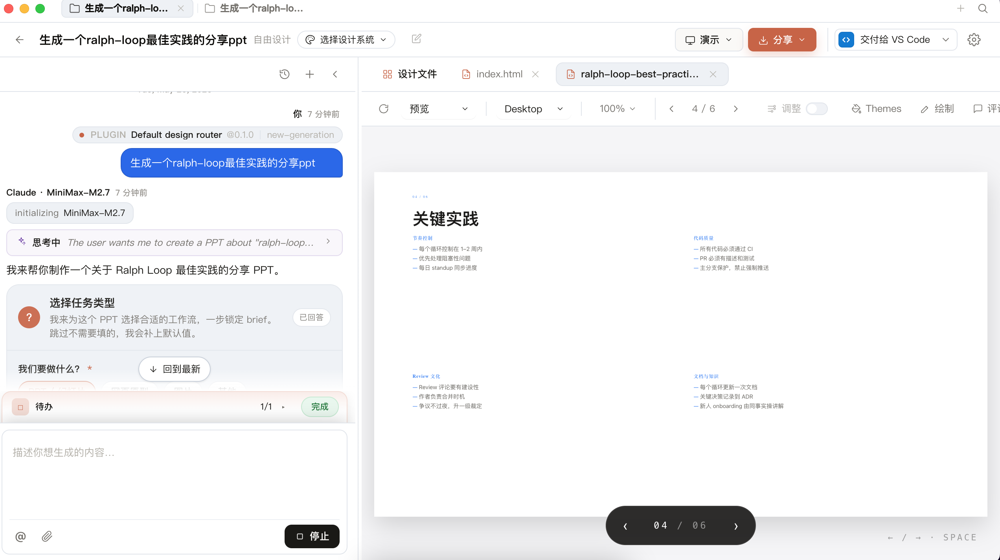
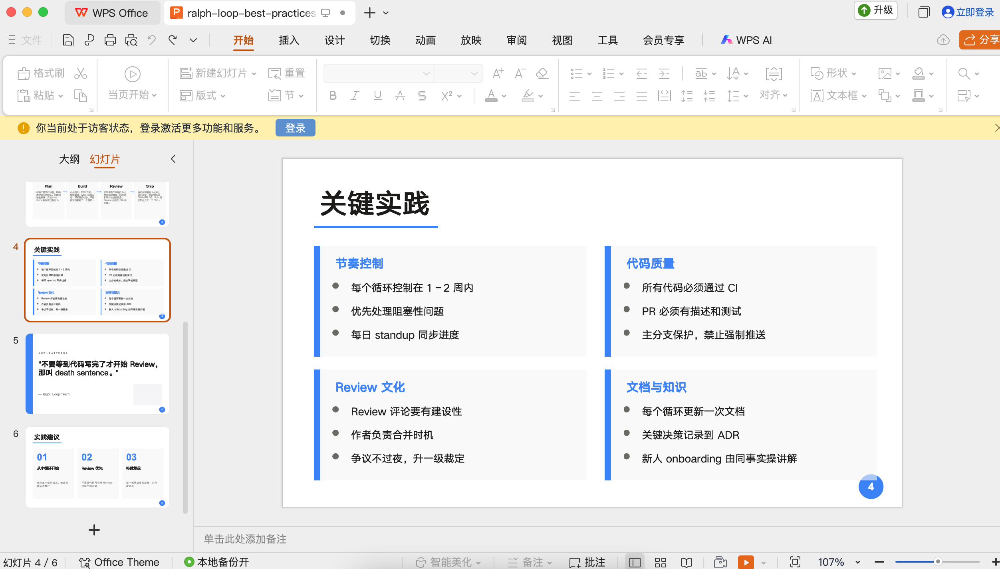

# 1. 实用 Skills 和 工具

> 创建时间：2026-05-12
> 更新：2026-05-12（改造为 skills/ 目录入口）

---

这是工具索引页，具体内容在 `skills/` 目录中。

> 新增 skill 时：在 `skills/` 目录新建 `.md` 文件，不要修改本文件内容。

## 1.1. 文档生成

### 1.1.1. PPT-Master：用自然语言生成 PPTX 文件

[PPT-Master](./skills/PPT_Master.md)

### 1.1.2. Open Design：视觉创作Claude Design的开源替代

**Claude Design介绍**：通过自然语言理解，让用户以对话方式完成从概念构思到成品交付的完整设计流程，彻底消除了设计软件的学习门槛。
* 与 Figma 或 Photoshop 不同，Claude Design 不要求用户掌握任何设计软件技能。你只需描述你想要的视觉效果，AI 就能理解意图并生成专业级作品。无论是融资路演 PPT、交互原型还是品牌落地页，都能在几分钟内从想法变为可交付的成果。
* 其中一个功能：一键生成专业演示文稿。上传内容要点，系统自动匹配品牌风格，生成逻辑清晰、视觉精美的 PPT，支持 `PPTX` 和 `PDF` 导出。

GitHub：[open-design](https://github.com/nexu-io/open-design/blob/main/README.zh-CN.md)

目前就Windows和Mac版本（20260526）。

## 1.2. 技巧工具

### 1.2.1. Prompt_Optimizer：提示词优化器

[Prompt_Optimizer](./skills/Prompt_Optimizer_提示词优化器.md)，将草稿 prompt 优化为 A/B/C/D 四种策略变体

## agent

### multica-ai：AI智能体编排系统

GitHub：[multica-ai](https://github.com/multica-ai/multica/blob/main/README.zh-CN.md)

见之前的博客实践：[AI能力集 -- 开发一个任务自动执行系统](https://xiaodongq.github.io/2026/04/19/ai-auto-task-system/)
